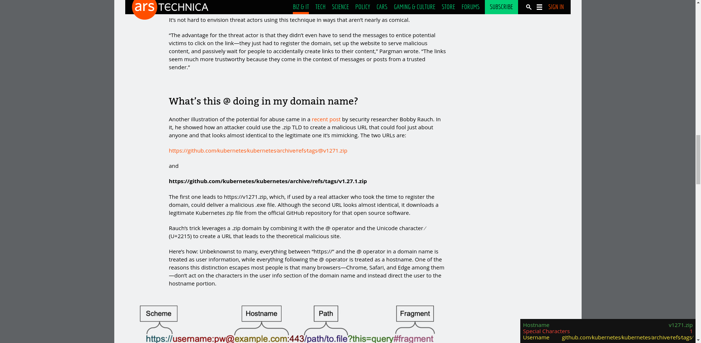

# URLVerifier
A chrome browser extension that allows you to quickly verify if a domain is real or fake.

[Article Source](https://arstechnica.com/information-technology/2023/05/critics-say-googles-new-zip-and-mov-domains-will-be-a-boon-to-scammers/)

## Installation:
* Method 1 (Recommended): Clone this repository and load it as an unpacked extenstion.
* Method 2 (Not recommended): Check the releases page and download the latest file.